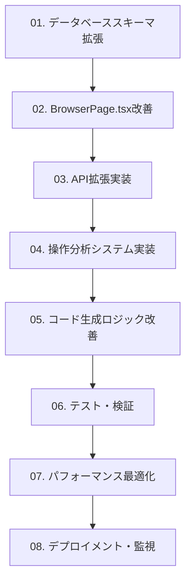

# Playwrightコード生成精度向上プロジェクト - 実装タスク一覧

## 概要

このディレクトリには、Playwrightテストコード自動生成機能の精度向上プロジェクトの詳細な実装タスクが含まれています。各タスクファイルは、実装すべき機能を細かく分解し、具体的な実装手順、検証方法、完了基準を提供しています。

## ⚠️ 重要: 開発共通ルール

**全てのタスクを実行する前に、必ず [`DEVELOPMENT_RULES.md`](./DEVELOPMENT_RULES.md) を読み、全てのルールに従ってください。**

### 必須ルール概要
- 各実装完了後に `npm run check-types`, `npm run lint`, `npm run test` が全て通ること
- ファイルが600行を超えたらリファクタリング実行
- DRY原則の徹底
- 新機能には必ずテストケースを作成
- テストケース名は日本語で記述
- Reactテストは Testing Library を使用し、アクセシビリティを重視

## 目標

現在のコード生成精度を**50%から80%**に向上させ、手動修正が不要なテストコードの生成を実現します。

## タスクファイル構成

### 📋 基盤整備タスク
- [`01-database-schema-tasks.md`](./01-database-schema-tasks.md) - データベーススキーマ拡張
- [`02-browser-page-enhancement-tasks.md`](./02-browser-page-enhancement-tasks.md) - BrowserPage.tsx改善

### 🔧 機能実装タスク
- [`03-api-enhancement-tasks.md`](./03-api-enhancement-tasks.md) - API拡張実装
- [`04-operation-analysis-tasks.md`](./04-operation-analysis-tasks.md) - 操作分析システム実装
- [`05-code-generation-logic-tasks.md`](./05-code-generation-logic-tasks.md) - コード生成ロジック改善

### 🧪 品質保証タスク
- [`06-testing-and-validation-tasks.md`](./06-testing-and-validation-tasks.md) - テスト・検証
- [`07-performance-optimization-tasks.md`](./07-performance-optimization-tasks.md) - パフォーマンス最適化

### 🚀 運用準備タスク
- [`08-deployment-and-monitoring-tasks.md`](./08-deployment-and-monitoring-tasks.md) - デプロイメント・監視

## 実装優先度

### 🔴 高優先度（即座に実装）
1. **データベーススキーマ拡張** - 新しいデータモデルの基盤
2. **UI状態追跡システム** - 動的要素対応の核心機能
3. **API拡張** - 拡張コンテキストを活用したコード生成

### 🟡 中優先度（2-4週間）
1. **操作分析システム** - ユーザー意図の理解
2. **動的要素対応** - モーダル・ドロップダウン等への対応
3. **堅牢なセレクタ戦略** - エラー耐性の向上

### 🟢 低優先度（長期的改善）
1. **パフォーマンス最適化** - システム全体の効率化
2. **監視・運用システム** - 継続的な品質向上
3. **高度な分析機能** - 機械学習による改善

## 実装フロー

## 各タスクの概要

### 01. データベーススキーマ拡張
- **期間**: 1-2週間
- **担当**: バックエンド開発者
- **内容**: OperationSession、UIStateTransition モデルの追加
- **成果物**: 拡張されたPrismaスキーマ、マイグレーションファイル

### 02. BrowserPage.tsx改善
- **期間**: 2-3週間
- **担当**: フロントエンド開発者
- **内容**: AdvancedUIStateTracker の実装
- **成果物**: 高度なUI状態追跡システム

### 03. API拡張実装
- **期間**: 2-3週間
- **担当**: バックエンド開発者
- **内容**: 拡張コンテキスト構築、新エンドポイント
- **成果物**: 拡張されたScenariosService、新API

### 04. 操作分析システム実装
- **期間**: 2-3週間
- **担当**: フロントエンド・バックエンド開発者
- **内容**: OperationSemanticAnalyzer の実装
- **成果物**: ユーザー意図分析システム

### 05. コード生成ロジック改善
- **期間**: 2-3週間
- **担当**: バックエンド開発者
- **内容**: 動的要素対応、堅牢なセレクタ戦略
- **成果物**: 改善されたコード生成エンジン

### 06. テスト・検証
- **期間**: 1-2週間
- **担当**: QAエンジニア・開発者
- **内容**: 単体・統合・E2Eテスト
- **成果物**: 包括的なテストスイート

### 07. パフォーマンス最適化
- **期間**: 1-2週間
- **担当**: フルスタック開発者
- **内容**: システム全体の最適化
- **成果物**: 高速化されたシステム

### 08. デプロイメント・監視
- **期間**: 1週間
- **担当**: DevOpsエンジニア
- **内容**: 本番環境構築、監視システム
- **成果物**: 本格運用可能なシステム

## 成功指標

### 定量的指標
- **生成精度**: 50% → 80%（手動修正不要率）
- **動的要素対応**: 0% → 90%（モーダル等の対応率）
- **実行成功率**: 60% → 85%（初回実行成功率）
- **開発時間短縮**: 30%削減（テスト作成時間）

### 定性的指標
- **ユーザビリティ向上**: より直感的なテスト作成
- **保守性向上**: 理解しやすいコード生成
- **拡張性向上**: 新しいUIパターンへの対応力

## 実装ガイドライン

### 開発原則
1. **共通ルール遵守**: [`DEVELOPMENT_RULES.md`](./DEVELOPMENT_RULES.md) の完全遵守
2. **段階的実装**: 既存機能を壊さない漸進的改善
3. **十分なテスト**: 各段階での包括的テスト
4. **ドキュメント化**: 実装内容の詳細な記録
5. **コードレビュー**: 品質保証のための相互レビュー

### 品質基準
- **テストカバレッジ**: 80%以上
- **TypeScript**: 型安全性の確保
- **ESLint/Prettier**: コード品質の統一
- **パフォーマンス**: 既存機能の性能劣化なし

## リスク管理

### 高リスク項目
1. **データベースマイグレーション**: 既存データの整合性
2. **LLM統合**: API制限とコスト管理
3. **パフォーマンス**: 大量データ処理の最適化

### 軽減策
1. **段階的実装**: 機能を小さく分割して実装
2. **十分なテスト**: 各段階での包括的テスト
3. **ロールバック計画**: 問題発生時の迅速な復旧

## 開始方法

1. **ルール確認**: [`DEVELOPMENT_RULES.md`](./DEVELOPMENT_RULES.md) を熟読
2. **環境準備**: 開発環境のセットアップ
3. **タスク選択**: 優先度に基づいてタスクを選択
4. **実装開始**: 各タスクファイルの手順に従って実装
5. **品質チェック**: `npm run check-types`, `npm run lint`, `npm run test` の実行
6. **検証**: 完了基準に基づいて検証
7. **次のタスク**: 依存関係に従って次のタスクに進む

## サポート

実装中に問題が発生した場合は、以下を参照してください：

- **技術仕様**: `docs/SPECIFICATION.md`
- **アーキテクチャ**: `docs/code-generation-improvement/`
- **既存コード**: 関連するソースコードファイル

このタスク一覧により、TestPilotのPlaywrightコード生成機能を大幅に改善し、業界最高水準のテスト自動化ツールを実現できます。
