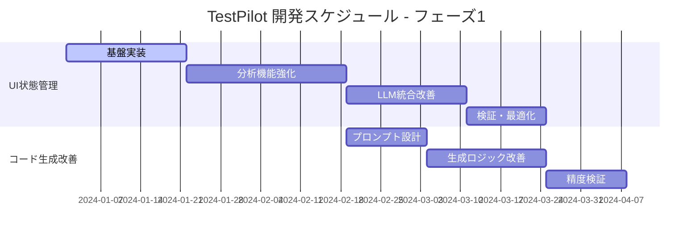
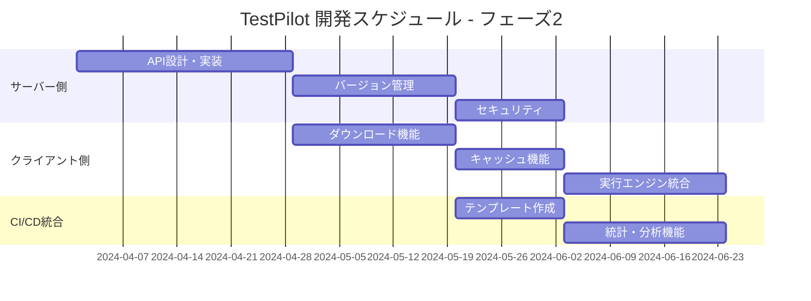

# TestPilot 開発TODO

このドキュメントでは、TestPilotの今後の開発予定項目について概要を説明します。各機能の詳細については、個別のドキュメントを参照してください。

## 📋 開発項目一覧

### 🎯 最優先項目

#### 1. [Playwrightテストコード生成精度向上](features/playwright-code-generation-improvement.md)
**現在の課題**: モーダル操作や動的コンテンツを含む複雑なユーザーフローのテストコード生成精度が低い

**解決アプローチ**: UI状態管理システムの導入により、ページ遷移を伴わない状態変化を追跡

**期待効果**:
- 実用的なテストコードの自動生成
- 手動修正作業の大幅削減
- テストカバレッジの向上

**開発期間**: 2-3ヶ月

---

#### 2. [UI状態管理システム](features/ui-state-management-system.md)
**目的**: ページ遷移を伴わない画面状態の変化を追跡・記録し、より精密なテストコード生成を実現

**主要機能**:
- MutationObserverベースの状態監視
- 操作シーケンスの記録・分析
- LLMプロンプトの拡張

**技術要素**:
- UIState データモデル
- 状態差分検出アルゴリズム
- 操作フロー分析

**開発期間**: 2-3ヶ月

---

### 🔧 重要項目

#### 3. [Playwrightコード配布システム](features/playwright-code-distribution-system.md)
**目的**: 生成されたテストコードの一元管理と配布システムの構築

**主要機能**:
- サーバー側でのコード管理・バージョン管理
- クライアント・CI/CDからのコード取得
- セキュアな環境分離

**メリット**:
- チーム間でのコード共有
- CI/CD統合の簡素化
- セキュリティの向上

**開発期間**: 3-4ヶ月

---

## 🗓️ 開発スケジュール

### フェーズ1: 基盤強化（2-3ヶ月）
**目標**: テストコード生成精度の根本的改善

**主要成果物**:
- [ ] UI状態管理システム
- [ ] 改善されたテストコード生成機能
- [ ] 動的コンテンツ対応

### フェーズ2: 配布システム構築（3-4ヶ月）
**目標**: エンタープライズ対応とチーム開発支援

**主要成果物**:
- [ ] コード配布API
- [ ] クライアント統合機能
- [ ] CI/CDテンプレート

### フェーズ3: 統合・最適化（1ヶ月）
**目標**: システム全体の安定化と運用準備

**主要タスク**:
- [ ] システム間連携の最適化
- [ ] パフォーマンス改善
- [ ] ドキュメント整備
- [ ] 運用監視機能

---

## 📊 成功指標

### 定量的指標
| 項目 | 現在 | 目標 |
|------|------|------|
| テストコード生成精度 | 40% | 80%+ |
| 動的要素対応率 | 20% | 90%+ |
| 初回実行成功率 | 60% | 85%+ |
| 手動修正時間 | 30分/テスト | 5分/テスト |

### 定性的指標
- [ ] 開発者満足度の向上
- [ ] テスト作成時間の短縮
- [ ] チーム間でのコード共有促進
- [ ] CI/CD統合の簡素化

---

## 🔗 関連ドキュメント

### 機能詳細
- [Playwrightテストコード生成精度向上](features/playwright-code-generation-improvement.md)
- [UI状態管理システム](features/ui-state-management-system.md)
- [Playwrightコード配布システム](features/playwright-code-distribution-system.md)

### プロジェクト情報
- [仕様書](SPECIFICATION.md) - 現在の機能詳細
- [README.md](../README.md) - プロジェクト概要
- [開発規約](development/) - コーディング規約・開発プロセス

---

## 📝 更新履歴

| 日付 | 更新内容 | 更新者 |
|------|----------|--------|
| 2024-01-XX | 初版作成、機能別ドキュメント分割 | - |
| 2024-01-XX | 開発スケジュール詳細化 | - |
